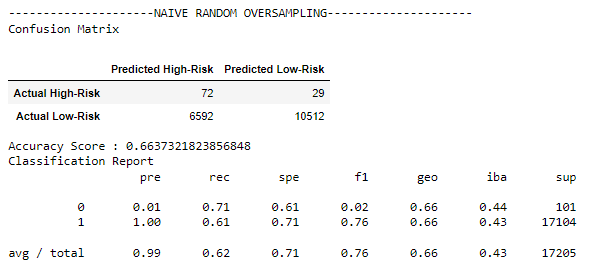
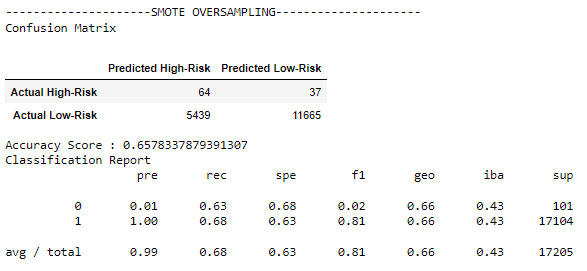
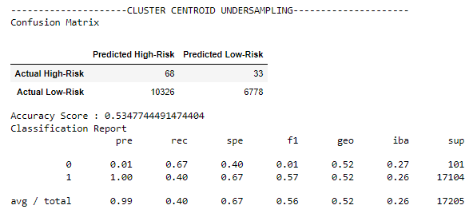
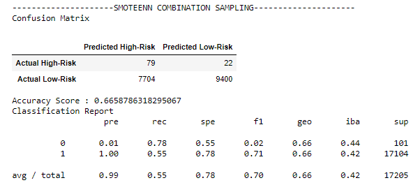
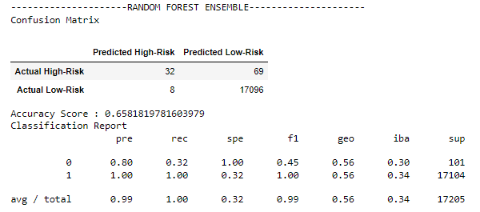
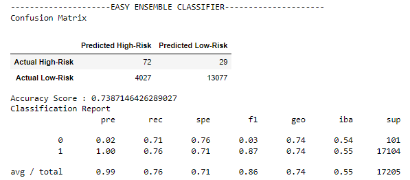

# Analysis of Credit Risk
## After demonstrating our knowledge of data preperation, statistical rasoning and machine learning, we were tasked with creating algorithms to assess credit risk. Because credit risk is an inherently unbalanced classification problem, we needed to use different tequniques and several models to train and and evaluate the dataset. We were asked to use two over-sampling models, an under-sampling model and a combinatorial appoarch. We also used two ensemble machine learning approaches to minimize bias.

## Results

### Naive Random Over-Sampling

We found the following metrics for our Naive Random Over-Sampling model:
  - Accuracy Score: 		66.4%
  - High-Risk Precision: 	0.01
  - Low-Risk Precision: 	1.00
  - Average Precison:		0.99
  - High-Risk Recall:		0.71
  - Low-Risk Recall:		0.61
  - Average Recall:		0.62

### Naive SMOTE Over-Sampling

We found the following metrics for our SMOTE Over-Sampling model:
  - Accuracy Score: 		65.8%
  - High-Risk Precision: 	0.01
  - Low-Risk Precision: 	1.00
  - Average Precison:		0.99
  - High-Risk Recall:		0.63
  - Low-Risk Recall:		0.68
  - Average Recall:		0.68

### Cluster Centroid Under-Sampling

We found the following metrics for our Cluster Centroid Under-Sampling model:
  - Accuracy Score: 		53.5%
  - High-Risk Precision: 	0.01
  - Low-Risk Precision: 	1.00
  - Average Precison:		0.99
  - High-Risk Recall:		0.40
  - Low-Risk Recall:		0.67
  - Average Recall:		0.67

### SMOTEENN Combination Sampling

We found the following metrics for our SMOTEENN Combination Sampling model:
  - Accuracy Score: 		66.6%
  - High-Risk Precision: 	0.01
  - Low-Risk Precision: 	1.00
  - Average Precison:		0.99
  - High-Risk Recall:		0.78
  - Low-Risk Recall:		0.55
  - Average Recall:		0.55

### Random Forest Ensemble Sampling

We found the following metrics for our Random Forest Ensemble Sampling model:
  - Accuracy Score: 		65.8%
  - High-Risk Precision: 	0.80
  - Low-Risk Precision: 	1.00
  - Average Precison:		0.99
  - High-Risk Recall:		0.32
  - Low-Risk Recall:		1.00
  - Average Recall:		1.00

### Easy Ensemble Sampling

We found the following metrics for our Random Forest Ensemble Sampling model:
  - Accuracy Score: 		73.9%
  - High-Risk Precision: 	0.02
  - Low-Risk Precision: 	1.00
  - Average Precison:		0.99
  - High-Risk Recall:		0.71
  - Low-Risk Recall:		0.76
  - Average Recall:		0.76	

## Summary
After running six different models, we cannot be decisive on which model is worth going forward with. Each model came up with different results but all the results were fairly sub par considering the impact of determining credit risk. With the exception of our Random Forest model, each model had a drastically high amount of false positives. This culd be concluded from looking at the confusio matrices as well as looking at the precision values. The Random Forest Model could be considered the best if having to chose one, but it still produced more false negatives than desired. It produced more than twice as many false negatives as True Positives would could have a significant impact on the lender

We summize that these models are experiencing over-fitting and to have more accurate and precise models, we would nee to limit the amount of features our models are learning from. We could use a combination of features that that the Random Forest model deemed important as well as what the lender might consider important. We could start at combination of 8-10 features and then narrow it down from there if our results still are not desired. We do feel that there is potential with this data set, however there is still much work to be done.